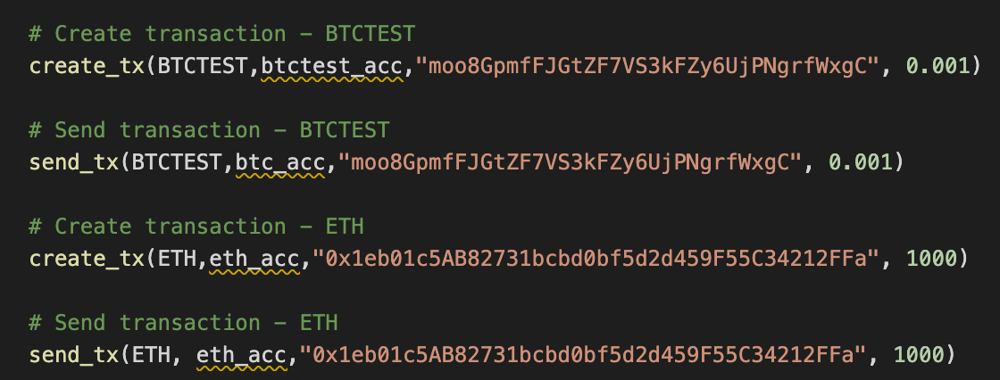

# Multi-Blockchain Wallet
This wallet was built using Python and HD-Wallet-Derive. Its function is to hold multiple addresses across different cryptocurrencies. In order to use this wallet, you need your mnemonic phrase in order to generate the addresses associated in specific coins. For this example, we used BTC, ETH (private test network), and BTC Testnet. The function to derive the accounts is derive_wallets.

After you derive the accounts from your mnemonic phrase, you need to convert one of the private keys in the dictionary to an object that can be used in web3 and bit. This is the priv_key_to_account function.

After this, you can begin creating and sending transactions. These are the functions used to do so:

